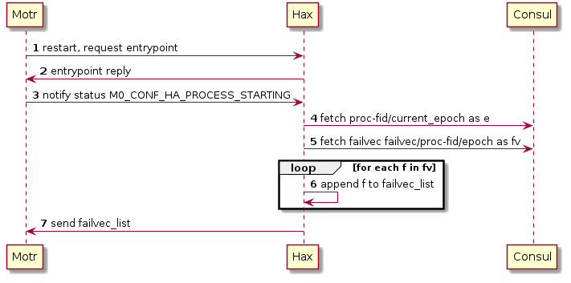

This document presents a high level design (HLD) of integration of Hare with
Motr's distributed transaction manager.

The main purposes of this document are: (i) to be inspected by Hare, Motr and
HA architects and peer designers to ascertain that high level design is aligned
with Hare, Motr and HA architecture and other designs and contains no defects,
(ii) to be a source of material for Active Reviews of Intermediate Design
(ARID) and detailed level design (DLD) of the same component, (iii) to
serve as a design reference document.

The intended audience of this document consists of Motr, HA and HARE customers,
architects, designers and developers.

## Table Of Contents

0. [Introduction](#Introduction)
1. [Definitions](#Definitions)
2. [Requirements](#Requirements)
3. [Assumptions](#Assumptions)
4. [Design Highlights](#Design-Highlights)
5. [Functional Specifications](#Functional-Specifications)
    * [Recovering process failure](#Recovering-process-failure)
    * [Participating process failure](#Participating-process-failure)
6. [Logical Specifications](#Logical-Specifications)
    * [Recovering process failure](#Recovering-process-failure)
    * [Participating process failure](#Participating-process-failure)
7. [External Interfaces](#External-Interfaces)
8. [State](#State)
9. [Use cases](#Use-Cases)
10. [Analysis](#analysis)
11. [References](#references)

<!-- toc -->

## Introduction
Motr implements distributed transaction manager in order to maintain atomicity
of updates to filesystem objects in case of failures. That said, the
corresponding recovery operations must be triggered explicitly. Hare maintains
the HA states of Motr configuration objects across failure domains in order as
they are received. Hare, thus implements required data structures and
interfaces in order to notify failures to Motr and trigger DTM recovery.

## Definitions

#### [hax](https://github.com/Seagate/cortx-hare/blob/main/rfc/5/README.md)
Hare and Motr exchange that receives, process and replies information to and
from Motr as well Consul.

#### [hctl](https://github.com/Seagate/cortx-hare/blob/main/rfc/11/README.md)
Hare controller interface to invoke Hare functionality explicitly.

#### Transient Failure
A Motr process is said to be transiently failed if the underlying persistent
storage is still accessible when the process restarts.

#### Participant
A Motr process from the same cluster that contributes to the dtm recovery of
an another failed Motr process.

#### Process Monitor
A process monitor is an external entity that monitors Motr and Hare processes,
that can be a Consul watcher or cortx-ha, which reports failure events to
Hare.

#### Pool
Set of server nodes with each node associated with storage devices.

## Requirements

### [r.failure.transient]
Hare must be able to detect and report a transient failure.

### [r.ha.epoch]
Hare must maintain an epoch corresponding to a Motr process and use it to
record all the relevant events with respect to that process.

### [r.outgoing.msg.timestamp]
All outgoing HA messages from Hare must have a timestamp that is consistent
across the cluster.

### [r.failure.order]
Hare must maintain and broadcast the events in order which they are received
with respect to a failed node.

### [r.DTM0.messages]
Hare must implement DTM0 messages as per the protocol in order to communicate
with DTM0 services in Motr.

### [r.DTM.participants]
Hare must know or should be able to identify the participating nodes in DTM
recovery with respect to a failed node.

### [r.DTM.Spiel.interface]
Hare invokes Motr Spiel API to send outgoing DTM messages.

### [r.DTM.recover]
Hare must be able to trigger DTM recovery for a failed node. DTM recovery
triggers must be sent to the participating nodes only.

### [r.DTM.trigger.once]
Hare must trigger DTM recovery for a given node exactly once with respect to
a failure. This requires all the hax process to coordinate.

### [r.DTM.recovery.states]
Hare must maintain DTM recovery states for all the nodes participating in
DTM recovery.

### [r.DTM.complete]
Hare must wait for DTM recovery complete messages from all the participating
nodes.

### [r.notify.online]
Hare must broadcast ONLINE ha event for the failed node on successful
completion of DTM recovery.

### [r.concurrent.failure]
Hare must handle Hax, Consul and additional Motr process failures during
an ongoing recovery.

## Assumptions

### [a.ha.timestamp.clock.sync]
The physical clock used by the Hare to timestamp outgoing ha messages is in
sync or has acceptable time difference with the nodes running motr processes.

## Design Highlights
Motr DTM helps to recover an incomplete meta data update transaction that was
partially executed only on a subset of nodes due a participating process
failure. Every node runs a Consul, a Hax and one or more Motr processes.
Every Motr process connects only to local hax as a ha process.
Hare monitors and maintains the states for Motr processes and is thus
responsible to trigger DTM recovery in case of transient failures
i.e. Motr process restart, crash, node restart, etc. The recovery is triggered
when the failed Motr process, mainly that hosts ioservice restarts. There are
multiple sources through which the Hare can receive a process or node failure
and online events, viz.: Consul and cortx-ha. It is important that Hare records
all the state changes with respect to a Motr process from its start in order as
they are received in order to facilitate decision making with respect to
DTM recovery and failure handling, hare uses Consul for the same. Following
sequence diagram illustrates a typical happy path for DTM recovery triggered
by Hare,

<!--
@startuml
autonumber
systemd -> consul: start
systemd -> hax: start
systemd -> motr: start
hax -> consul: populate kv
    loop if RC
        hax -> consul: initialize failure vector and epoch
    end
destroy motr
process_monitor -> hax: notify motr failure
hax -> consul: update motr process state to M0_CONF_HA_PROCESS_STOPPED
    loop if RC
        hax -> consul: update motr process ha state to M0_NC_FAILED
        hax -> consul: add a failvec entry for current epoch
    end
motr -> hax: restarts, send entrypoint request
hax -> consul: fetch ha states for given epoch
hax -> motr: send entrypoint reply and ha states
hax -> hax: analyse failure vector
hax -> consul: update motr process ha state to M0_NC_TRANSIENT
hax -> motr: broadcast M0_NC_TRANSIENT using BQ
motr -> hax: notify M0_CONF_HA_PROCESS_STARTING
hax -> consul: update motr process ha state to M0_NC_RECOVERING
hax -> motr: boradcast M0_NC_RECOVERING
hax -> hax: wait for dtm recovery to complete
motr -> hax: notify M0_CONF_HA_PROCESS_STARTED
hax -> consul: update motr process status to M0_CONF_HA_PROCESS_STARTED
hax -> consul: update motr process ha state to M0_NC_ONLINE
hax -> motr: broadcast M0_NC_ONLINE
@enduml
-->

#### Notes
1. As hax will be updating atleast 2 KVs (Motr process status and
failure vector), it will be good to consider [Consul Transactions](https://www.consul.io/api-docs/txn).
2. All the failure events are typically delivered to all the hax processes in
the pool for a given storage device, Hare or Motr processes by process
monitor. Subsequent state transitions for a device or Motr process is
controlled by the hax process that is handling the recovery of the
corresponding Motr device or process.
Following sequence diagram illustrates the situation,
<!--
@startuml
autonumber
process_monitor -> Hare0_RC: notify motr_ios2 failure
process_monitor -> Hare1: notify motr_ios2 failure
process_monitor -> Hare2: notify motr_ios2 failure
Hare0_RC -> motr0: notify motr_ios2 failure
Hare1 -> motr1: notify motr_ios2 failure
Hare2 -> motr2_clients: notify motr_ios2 failure
Hare0_RC -> Consul: post motr_ios2 process state update EQ event
Hare1 -> Consul: post motr_ios2 process ha state update EQ event
Hare2 -> Consul: post motr_ios2 process ha state update EQ event
Hare0_RC -> Consul: process EQ event, update motr_ios2 process ha state
process_monitor -> Hare0_RC: notify motr_ios2 start
process_monitor -> Hare1: notify motr_ios2 start
process_monitor -> Hare2: notify motr_ios2 start
motr_ios2 -> Hare2: request entrypoint
Hare2 -> Consul: update motr_ios2 process ha state
Hare2 -> motr_ios2: trigger DTM recovery
motr_ios2 -> Hare2: notify DTM completion
Hare2 -> Consul: update motr_ios2 process ha state
@enduml
-->

## Functional Specifications
[This section describes "what" can be done to meet the requirements]

Hare implements the required data structures and interfaces to support DTM0.
Additionally, when Hare receives an online event for a failed process, it
identifies the participating nodes in the DTM recovery of the given process
and before marking the node online, Hare initiates DTM recovery. On completion
of the DTM recovery, Hare updates the node status as ONLINE to rest of the
cluster.

### Transient Failure
Hare maintains a hierarchy or Motr configuration objects that includes hardware
as well as software components. Hare receives hardware (controller, enclosure,
rack, etc.) and software events from cortx-ha which are recorded in consul KV.
Using this information Hare can identify if a process was transiently failed
and DTM recovery needs to be initiated.

### HA epoch
Hare records an epoch when a Motr process transitions to ONLINE state. This
epoch is used to record relative ha state transitions with respect to a
given Motr process.

### Failure order
Hare maintains a list of failure events known as failure vector for the
cluster. The events in the list are ordered as they are received. Hare
sends the failure vector to Motr process when it restarts and during
DTM recovery.

### DTM Messages
Hare implements DTM0 messages required to communicate with Motr DTM services,
e.g. "start recovery", "recovery updates", "recovery complete".

### DTM participants
Hare understands the participating Motr processes and the corresponding nodes
in the failed process's DTM recovery. Hare communicates with the participating
processes via DTM messages.

### DTM Spiel interfaces
Hare uses Motr Spiel interface to send outgoing DTM messages to the
participating Motr processes.

### DTM trigger once
Failure and online events are received by all the hax processes in the cluster.
Thus it is important that DTM recovery trigger is sent only once thus the
decision for the same is taken only by one hax process. This can be done
via Hare recovery coordinator process.

### DTM recovery states
Hare maintains and updates the states for participating Motr processes in
Consul during DTM recovery. Saved states are used to handle concurrent
failures and process restarts.

### DTM Complete
Once Hare triggers DTM, Hare needs to wait until the recovery is complete,
that could be either success or failure. The recovering process sends a
Recovery DONE message to Hare in case of success, Hare then broadcasts
ONLINE for the recovering process. In case of failure, Hare keeps the
process in RECOVERING state and broadcasts recovery failure to other
processes in the pool/cluster. Hare then waits for next trigger to re-initiate
DTM recovery.

### Concurrent failures
In case of another process failure during ongoing DTM recovery following
scenarios must be considered,

#### Recovering process failure
   In such a situation Hare will not receive DTM recovery completion message
   thus the state remains unchanged as RECOVERING. Once the process restarts
   Hare check the existing state of the process and re-triggers DTM recovery.

#### Participating process failure
   Hare either aborts or continues the ongoing DTM recovery, depending on the
   current and tolerated failures.

## Logical Specifications
[This section describes the "How" the requirements can be met.]

### Transient failure
Hare maintains a hierarchy of Motr configuration objects along with its states,
e.g. storage devices, in Consul. When hare receives a devices failure
notification, it updates the state of the corresponding Motr object in Consul.
Thus, when a Motr process fails and restarts, the corresponding failure is
treated as a transient failure if there are no storage failures, Hare triggers
DTM recovery so that the transaction can be redone successfully.

<!--
@startuml
autonumber
Hare -> Consul: KV upload
HA -> Hare: notify device failure
Hare -> Consul: update Motr device state
process_monitor -> Hare: Motr process failure
Hare -> Consul: update Motr process state
Motr -> Hare: restarts, requests Entrypoint
Motr -> Hare: notifies M0_CONF_HA_PROCESS_STARTING
    loop if no corresponding storage failures
        Hare -> Motr: DTM Recovery Start
    end
@enduml
-->

### HA Epoch
Hare maintain a Consul KV for epoch which is initialized when cluster
bootstraps, mainly by the RC leader when it is elected. An epoch is a counter
that is updated only by RC leader and used to record the cluster wide HA
events with respect to Motr processes.
When a Motr process transitions to ONLINE the corresponding hax process
receives an event (M0_CONF_HA_PROCESS_STARTED) from the Motr process.
Hax then creates or updates the `<proc-fid>/current_epoch:epoch#` KV.
Additionally, Hax creates `failvec/<proc-fid>/<Epoch>:{}` KV where the
relative failure events are recorded. Epoch number initially is set to 0 and
the corresponding failure vector KV is also initialized to an empty list.
failure events relative to this Motr process since the process started are
then atomically recorded at the failure vector KV for a given epoch.
Thus all the device failures and the process failure itself are recorded with
respect to this epoch. When a Motr process restarts the current epoch number
(`<proc-fid>/current_epoch:epoch#`) is updated and a new epoch KV is created
by the corresponding hax process.
Following sequence diagram illustrates the same,
<!--
@startuml
autonumber
systemd -> haxN: Start
systemd -> MotrN: Start
systemd -> consul: Start
MotrN -> haxN: Entrypoint request
haxN -> MotrN: Entrypoint reply
haxN -> MotrN: DTM recovery start if required
MotrN -> haxN: Recovery complete
MotrN -> haxN: notify M0_CONF_HA_PROCESS_STARTED
haxN -> consul: fetch and update or create "proc-fid/epoch"
haxN -> consul: create "failvec/proc-fid/epoch:{}"
@enduml
-->

### Failure order
Hare records all the failure events with respect to Motr processes in the
cluster in the order as they are received. It is important that the failures
are arranged such that it is efficient to compile a list and prune the same as
required. Failures can be recorded in order as follows,

Consul key prefix | value | Updated by
--- | --- | ---
proc-fid/current_epoch | Integer | Hare RC
failvec/proc-fid/epoch/nr_failures | Integer | Hare RC
failvec/proc-fid/epoch | Dictionary of configuration objects and ha state | Hare RC

e.g.
failvec/proc-fid/epoch:{<conf-obj-fid>:FAILED}

When a hax process receives a failure event for a Motr process, it reads
the last ONLINE event epoch and adds a new entry to event queue in-order
to update failure vector.

#### Failvec update
Hare event and broadcast queue mechanism is leveraged here. When a hax process
receives a failure event, it creates an event and enqueues it into the event
queue (EQ). RC leader then processes the event. It updates the failure count
with respect to that epoch and creates a new failure vector entry as mentioned
above. While updating the failure vector, it is possible that there are duplicate
event queue entries for the same event (as the failure event is received on
multiple nodes). In order to handle this duplication, RC leader checks if the
corresponding failure event is already added to the failure vector for the
given epoch and discards the duplicate events if already recorded.
Following sequence diagram illustrates the flow of information in this case,

<!--
@startuml
autonumber
process_monitor -> hax0_RC: reports failure of Motr1
process_monitor -> hax1: reports failure of Motr1
process_monitor -> hax2: reports failure of Motr1
hax0_RC -> Consul: Add a failure vector update event to EQ with epoch e
hax1 -> Consul: Add a failure vector update event to EQ with epoch e
hax2 -> Consul: Add a failure vector update event to EQ with epoch e
hax0_RC -> Consul: process EQ
hax0_RC -> hax0_RC: gets the event, updates the failure vector dict for the given epoch
hax0_RC -> Consul: Fetch next event
hax0_RC -> hax0_RC: discard the event if already recorded for the given epoch
@enduml
-->

Hax can then iterate over required epochs for a process to create a list of
relevant failure events from the corresponding failure vectors.

#### Failvec build
During DTM recovery Hare needs to send all the ha notifications corresponding
to a Motr process. This list of ha notifications can be built using the failure
events saved in Consul with respect to a single or multiple epochs. Hax fetches
KV(s) corresponding to current or a set of epochs. By iterating over the ha
events dictionaries from each key, hax can build a single list of ha events
to be sent to one or more Motr processes. Following sequence diagram
illustrates a typical failvec build case,
<!--
@startuml
autonumber
Motr -> Hax: restart, request entrypoint
Hax -> Motr: entrypoint reply
Motr -> Hax: notify status M0_CONF_HA_PROCESS_STARTING
Hax -> Consul: fetch proc-fid/current_epoch as e
Hax -> Consul: fetch failvec failvec/proc-fid/epoch as fv
    loop for each f in fv
        Hax -> Hax: append f to failvec_list
    end
Hax -> Motr: send failvec_list
@enduml
-->

### DTM Messages
Hare sends the failure vector and ha states corresponding to a recovering
process using Motr [ha_note](https://github.com/Seagate/cortx-Motr/blob/83f069b1b1c4954c3835d367c7bb214c51df4770/ha/note.h#L159)
and halink protocol. All outgoing messages from Hare are sent over Motr [halink](https://github.com/Seagate/cortx-Motr/blob/main/ha/link.h)
or via explicit Motr [Spiel](https://github.com/Seagate/cortx-Motr/blob/main/spiel/spiel.h)
interface. Hare implements data structures that map to Motr DTM0 data structures.

### DTM participants
All the peer Motr processes from the pool corresponding to the failed process
participate in the DTM recovery of that process. Thus Hare broadcasts all the
relevant ha events and DTM messages to the participating processes only as
depicted by the following sequence diagram.

<!--
@startuml
autonumber
m0client -> Motr0: IO
m0client -> Motr1: IO
destroy Motr1
m0client -> Motr2: IO
process_monitor -> Hax0_RC: report Motr1 failure
process_monitor -> Hax1: report Motr1 failure
process_monitor -> Hax2: report Motr1 failure
Hax0_RC -> Motr0: notify Motr1 M0_NC_FAILED
Hax2 -> Motr2: notify Motr1 M0_NC_FAILED
Hax0_RC -> m0clients0: notify Motr1 M0_NC_FAILED
Hax1 -> m0clients1: notify Motr1 M0_NC_FAILED
Hax2 -> m0clients2: notify Motr1 M0_NC_FAILED
Hax1 -> Consul: update Motr1 status to M0_CONF_HA_PROCESS_STOPPED
Motr1 -> Hax1: Motr1 restarts, sends Entrypoint request
Motr1 -> Hax1: notify M0_CONF_HA_PROCESS_STARTING
Hax1 -> Motr1: send ha states
Hax1 -> Consul: update Motr1 status to M0_CONF_HA_PROCESS_STARTING
Hax1 -> Hax1: check if its a transient failure (if not storage controller failure)
Hax1 -> Consul: post BQ event to broadcast Motr1 M0_NC_RECOVERING
    loop if MotrN.pool == Motr1.pool
        Hax0_RC -> Motr0: notify Motr1 M0_NC_RECOVERING
        Hax1 -> m0clients1: notify Motr1 M0_NC_RECOVERING
        Hax2 -> Motr2: notify Motr1 M0_NC_RECOVERING
    end
Hax1 -> Hax1: wait for DTM recovery complete event
Motr1 -> Hax1: recovery complete, notify M0_CONF_HA_PROCESS_STARTED
Hax1 -> Consul: update Motr1 status to M0_CONS_HA_PROCESS_STARTED
Hax1 -> Consul: post BQ event to broadcast Motr1 M0_NC_ONLINE
@enduml
-->

### DTM Spiel interfaces
Hare uses Motr Spiel interfaces for outgoing DTM messages.
#### Todo
- [x] List Spiel interfaces to be invoked.

### DTM trigger once
Motr process restart event is received by all the processes via HA or Consul.
But only the local hax process to the restarted Motr process receives
entrypoint request. Thus, only the local hax process handles the DTM recovery
related tasks.

<!--
@startuml
autonumber
process_monitor -> hax1: Motr2 is online
process_monitor -> hax2: Motr2 is online
process_monitor -> hax3: Motr2 is online
Motr2 -> hax2: restarts, sends entrypoint request
hax2 -> consul: fetch HA events for the latest epoch
hax2 -> consul: post broadcast event to broadcast TRANSIENT to all Motr processes
hax1 -> Motr1: notify Motr2 TRANSIENT
hax2 -> Motr2: notify Motr2 TRANSIENT
hax3 -> Motr3: notify Motr2 TRANSIENT
hax2 -> Motr2: send all ha events
hax2 -> hax2: wait for DTM recovery complete
Motr2 -> hax2: Notify M0_CONF_HA_PROCESS_STARTED
hax2 -> consul: post broadcast event to broadcast ONLINE to all the Motr processes
hax1 -> Motr1: notify Motr2 ONLINE
hax2 -> Motr2: notify Motr2 ONLINE
hax3 -> Motr3: notify Motr2 ONLINE
@enduml
-->

### DTM recovery states
When a Motr process starts a DTM recovery, post entrypoint reply, the
corresponding Motr process status is set to M0_CONF_HA_PROCESS_STARTING.
Also the ha state for the process is set to M0_NC_RECOVERING. Process
state updates are done by the failed process's local hax process only.
Thus, if the recovering process restarts during DTM recovery, Hare can read
the last statuses from consul KV and take a decision to re-trigger DTM
recovery or not. Following sequence diagram illustrates the scenario,

<!--
@startuml
autonumber
Motr2 -> hax2: restart, request entrypoint
hax1 -> Motr1: notify Motr2 TRANSIENT
hax2 -> Motr2: notify Motr2 TRANSIENT
hax2 -> consul: update Motr2 ha state to M0_NC_TRANSIENT
hax3 -> Motr3: notify Motr2 TRANSIENT
hax2 -> Motr2: entrypoint reply
Motr2 -> hax2: notify M0_CONF_HA_PROCESS_STARTING
hax2 -> consul: update Motr2 status to M0_CONF_HA_PROCESS_STARTING
hax2 -> consul: update Motr2 ha state to M0_NC_RECOVERING
destroy Motr2
process_monitor -> hax2: notify Motr2 failure
hax2 -> consul: fetch last ha state
hax2 -> hax2: if ha state M0_NC_RECOVERING, do nothing
Motr2 -> hax2: restart, request entrypoint
hax2 -> consul: fetch last ha state
hax2 -> hax2: if M0_NC_RECOVERING, restart recovery
hax2 -> Motr2: send ha states, send M0_NC_RECOVERING
hax2 -> hax2: wait for recovery
Motr2 -> hax2: M0_CONF_HA_PROCESS_STARTED
hax2 -> consul: Broadcast M0_NC_ONLINE for Motr2
@enduml
-->

### DTM Complete
Post triggering DTM recovery, Hare waits until it is completed
before broadcasting M0_NC_ONLINE for the failed Motr process. While
waiting for an instance of DTM recovery to be completed, Hare will not
block and will be free to process other ha events for Motr. This is done
with the help of maintaining the process states in Consul and respective
callbacks for DTM state updates. When Motr process completes DTM, it
sends M0_CONF_HA_PROCESS_STARTED notification to its local hax process only.
On this event, Hare then broadcasts ONLINE to all the Motr processes via BQ.
In case of any failure during the recovery process Hare handles the situation
again with the help of states saved in the Consul. This is also described in
the `DTM recovery states section`.

### Concurrent failures
Following concurrent failures can be considered,
#### Recovering process failure
In this case Hare receives a failure notification for the recovering process.
If Hare has already update the process's ha state to M0_NC_RECOVERING and its
status to M0_CONF_HA_PROCESS_STARTING, then on the next restart of the failed
Motr process Hare refers to the process's saved states to take a decision to
re-trigger DTM recovery. This is also illustrated in `DTM Recovery States`
section.
If Hare finds the saved ha states as M0_NC_FAILED or M0_NC_TRANSIENT and
process status as M0_CONF_HA_PROCESS_STOPPED, then Hare broadcasts
M0_NC_TRANSIENT for that Motr process and restarts DTM recovery process.
<!--
@startuml
autonumber
process_monitor -> hax1_RC: notify Motr2 failure
process_monitor -> hax2: notify Motr2 failure
process_monitor -> hax3: notify Motr2 failure
hax1_RC -> consul: post a EQ event to update failvec and process ha state
hax2 -> consul: post a EQ event to update failvec and process ha state
hax3 -> consul: post a EQ event to update failvec and process ha state
hax1_RC -> consul: process EQ, update failvec and Motr2 ha state, discards duplicates
Motr2 -> hax2: restarts, requests entrypoint
hax2 -> consul: fetches failvec for current Motr2 epoch
hax2 -> Motr2: send entrypoint reply with ha states
hax2 -> consul: update Motr2 ha state to M0_NC_TRANSIENT and broadcast (BQ) the same
Motr2 -> hax2: notifies M0_CONF_HA_PROCESS_STARTING
hax2 -> consul: updates Motr2 process status to M0_CONF_HA_PROCESS_STARTING and ha state to M0_NC_RECOVERING
hax2 -> hax2: wait for dtm recovery to complete
destroy Motr2
process_monitor -> hax1_RC: notify Motr2 failure
process_monitor -> hax2: notify Motr2 failure
process_monitor -> hax3: notify Motr2 failure
hax1 -> consul: get Motr2 ha state
hax2 -> consul: get Motr2 ha state
hax3 -> consul: get Motr2 ha state
    loop if Motr2 ha state is M0_NC_RECOVERING
        hax1 -> hax1: do nothing, let Motr2 local, hax2 handle
        hax2 -> hax2: wait for Motr2 to restart
        hax3 -> hax3: do nothing, let Motr2 local hax2 handle
    end
Motr2 -> hax2: restarts, requests entrypoint
hax2 -> Motr2: sends entrypoint reply, ha states
hax2 -> consul: post BQ event to broadcast M0_NC_TRANSIENT
hax2 -> consul: post BQ event to broadcast M0_NC_RECOVERING
hax2 -> hax2: wait for dtm recovery to complete
@enduml
-->

#### Participating process failure
If a participant Motr process fails during ongoing DTM recovery, then Hare
broadcasts M0_NC_FAILED notification to all the Motr processes, in this case
the ongoing DTM recovery may complete or fail. In case of DTM recovery failure,
Hare transitions the RECOVERING process to TRANSIENT and waits for the next
event.
<!--
@startuml
autonumber
process_monitor -> hax1_RC: notify Motr2 failure
process_monitor -> hax2: notify Motr2 failure
process_monitor -> hax3: notify Motr2 failure
hax1_RC -> consul: post a EQ event to update failvec and process ha state
hax2 -> consul: post a EQ event to update failvec and process ha state
hax3 -> consul: post a EQ event to update failvec and process ha state
hax1_RC -> consul: process EQ, update failvec and Motr2 ha state, discards duplicates
Motr2 -> hax2: restarts, requests entrypoint
hax2 -> consul: fetches failvec for current Motr2 epoch
hax2 -> Motr2: send entrypoint reply with ha states
hax2 -> consul: update Motr2 ha state to M0_NC_TRANSIENT and broadcast (BQ) the same
Motr2 -> hax2: notifies M0_CONF_HA_PROCESS_STARTING
hax2 -> consul: updates Motr2 process status to M0_CONF_HA_PROCESS_STARTING and ha state to M0_NC_RECOVERING
hax2 -> hax2: wait for dtm recovery to complete
destroy Motr1
process_monitor -> hax1_RC: notify Motr1 failure
process_monitor -> hax2: notify Motr1 failure
process_monitor -> hax3: notify Motr1 failure
hax2 -> Motr2: notify Motr1 failure
hax3 -> Motr3: notify Motr1 failure
hax1_RC -> consul: post an EQ event to update failvec and Motr1 ha state
hax2 -> consul: post an EQ event to update failvec and Motr1 ha state
hax3 -> consul: post an EQ event to update failvec and Motr1 ha state
hax1_RC -> consul: process EQ, update failvec and Motr1 ha state, discards duplicate
hax2 -> hax2: wait for dtm recovery to complete
Motr2 -> hax2: report dtm recovery failure or success
    loop if dtm recovery failure
        hax2 -> consul: reset Motr2 ha state to M0_NC_TRANSIENT
    end
@enduml
-->

#### Hax process failure
If hax process fails and restarts, it needs to reestablish the halinks with its
local Motr processes. Halinks are initiated as part of Motr processes startup,
when Motr processes requests entrypoint, hax replies to the entrypoint and
establishes halink. Thus, presently if Hax restarts, corresponding Motr
processes also need to be restarted in order to reestablish the halinks.
For cortx, this situation is expected to be handled via cortx-ha implementation
using pacemaker.

#### Todo
- [x] Revisit post [EOS-18514](https://jts.seagate.com/browse/EOS-18514).

## External Interfaces
[This section describes any external interfaces used by or exposed by Hare.]

Hare uses Motr Spiel API to send DTM0 specific messages to Motr if required,
e.g. DTM0 fops.

#### Todo
- [x] update actual Motr Spiel interfaces.

## State
[This sections describes the state machines are transitions that Hare implements to support DTM0.]
Following diagram depicts the states transitions that happen in case of Motr process failure,

## Use Cases

### Recovering process failure during DTM recovery

### Participant process failure during DTM recovery

### Storage device failure during DTM recovery

### hax failure during recovery

### Recovering process node failure during DTM recovery

### Participant process node failure during DTM recovery

### More than tolerable existing failures in the cluster before starting recovery
