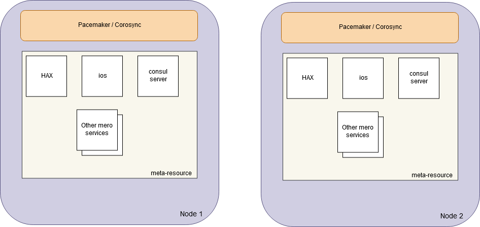
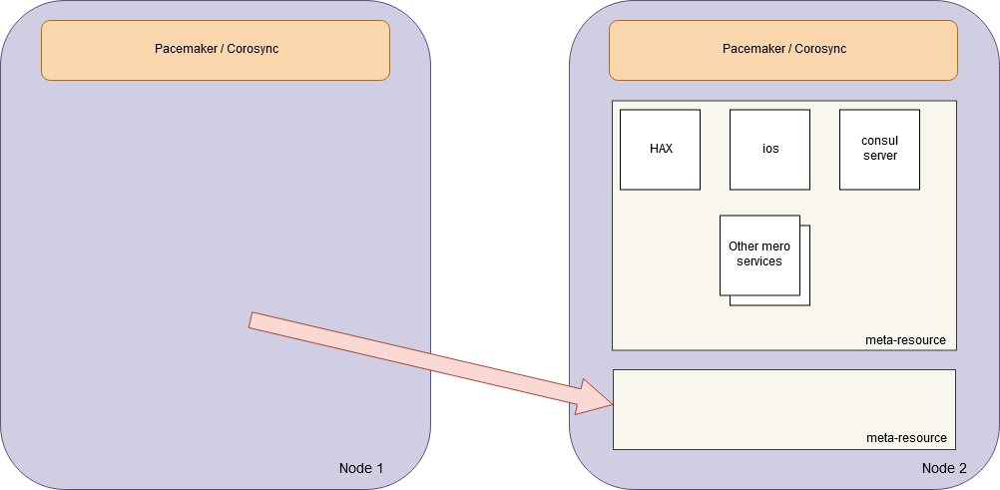

## Language

The key words "MUST", "MUST NOT", "REQUIRED", "SHALL", "SHALL NOT",
"SHOULD", "SHOULD NOT", "RECOMMENDED", "MAY", and "OPTIONAL" in this
document are to be interpreted as described in
[RFC 2119](https://tools.ietf.org/html/rfc2119).

## High Availability

XXX Currently this is not a specification, but an inception of one.

---

## Facts about Pacemaker

1. Each service in a HA cluster is named _resource_ in terms of
   Pacemaker
   ([link](https://clusterlabs.org/pacemaker/doc/en-US/Pacemaker/1.1/html/Pacemaker_Explained/s-resource-supported.html)).

2. If something is registered as a resource, Pacemaker will monitor
   (health-check) that resource.

   * For monitoring to happen, each resource MUST be equipped with CLI
     interface (e.g., LSB or OCF-compliant scripts).

   * Alternatively, Pacemaker can leverage `systemctl` commands for
     resources that are valid systemd units.

3. Pacemaker implementation leverages Corosync for consistency between
   nodes.

4. Pacemaker considers the state of each resource separately.

   If a resource fails for any reason, it will be moved to another node.

   This means that the approach of re-configuring the whole cluster
   after the first fail can only be implemented manually.

### Note 1

In two-nodes cluster it is questionable how the cluster will be
resilient to failures and how will it get back to two-nodes mode again.

By default, two-nodes cluster will become non-functional if one of
the nodes is down, since no quorum is available then.

Options:

1. Use corosync's `two_node` option to tweak the quorum votes
   calculation
   ([link](https://unix.stackexchange.com/questions/502400/quorum-in-a-two-node-cluster-with-pacemaker)).

   Split-brain is believed to be worked-around by means of fencing:
   the first node who kills another one becomes the winner.  This approach is
   [criticized though](http://blog.clusterlabs.org/blog/2018/two-node-problems).

2. Turn off the quorum: `no-quorum-policy: ignore`
   ([link](https://clusterlabs.org/pacemaker/doc/en-US/Pacemaker/1.1/html/Pacemaker_Explained/s-cluster-options.html))

## EES challenges

It is assumed that EES cluster will have predefined static configurations
and Pacemaker will simply switch between them.

How this can be achieved with Pacemaker?

Hare and Mero services are not represented as separate resources in
Pacemaker.  Instead, Pacemaker will see a facade or a meta-resource.

**XXX** andriy> Have you explored the possibility of configuring
[resource sets](https://clusterlabs.org/pacemaker/doc/en-US/Pacemaker/2.0/html/Pacemaker_Explained/s-resource-sets.html)?

**XXX** konstantin> Thanks for the link!  As far as I can see it can
help having the resources kept together at the same node but this
gives me no idea how to trigger our Hare cluster to re-configure.
There is simply no such event like "onFailover".  Every resource is
failed-over separately from each other.

## Requirements for meta-resource

1. In normal case, each instance of the meta-resource MUST run at
   separate node.

2. In case of failover, Pacemaker MUST be able to move the failed
   instance of the meta-resource to another node.

3. When the meta-resource is "STARTED" at the node where another
   instance of the meta-resource is "ALIVE", the cluster must be
   re-configured into one-node state.

4. The meta-resource script MUST monitor the status of local Consul,
   Hare, and Mero processes.  If any of them is not healthy, the
   meta-resource instance MUST be presented to Pacemaker as "FAILING".

### Meta-resource notes

1. The meta-resource script becomes rather complicated, as it will be
   responsible for starting, monitoring, and stopping the services it
   represents.

2. The meta-resource seems to have a list of internal states, such as:

   - STARTING_NORMALLY
   - STARTING_AS_STUB (i.e., when this instance is started just to
     trigger cluster re-configuration)
   - RECONFIGURING_SINGLE_NODE
   - STARTED_NORMALLY
   - SHUTTING_DOWN

3. The proposed schema does not prevent Pacemaker from handling other
   resources normally.  For example, CSM may be handled separately,
   not as part of meta-resource.

## Ideas from Ivan Tischenko

1. Meta-resource MUST NOT expose or hide any process to/from Pacemaker.
   It is not a facade.

2. Meta-resource is just a way to trigger cluster re-configuration in
   case of node failure.

Benefits when compared to the meta-resource idea (see above):

* Meta-resource is not responsible for monitoring other services and
  processes.

* As a result, it won't have any complicated internal state.

### Details

1. All our services - Consul, hax, Mero - are exposed as _normal_
   Pacemaker resources.

2. In addition to normal resources, a stub resource is added.  This
   document refers to it as the _meta-resource_.

3. The meta-resource has no dependencies on other resources.  Its
   startup script can reuse `start` and `stop` operations to impact
   other processes and system services (those can potentially be
   Pacemaker's resources).

4. We can use Pacemaker capabilities to ensure that two meta-resources
   run on separate nodes, allowing them both to run on the same node
   in the worst case.

   **XXX-TODO** Research how this can be achieved.

5. When meta-resource instance is started on the node where another
   instance is running, the newly started meta-resource triggers
   cluster re-configuration.

## Questions

1. How to do bootstrap the cluster at the very beginning?
