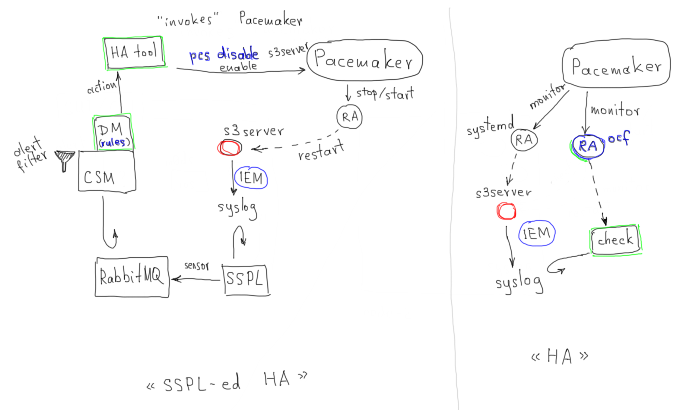
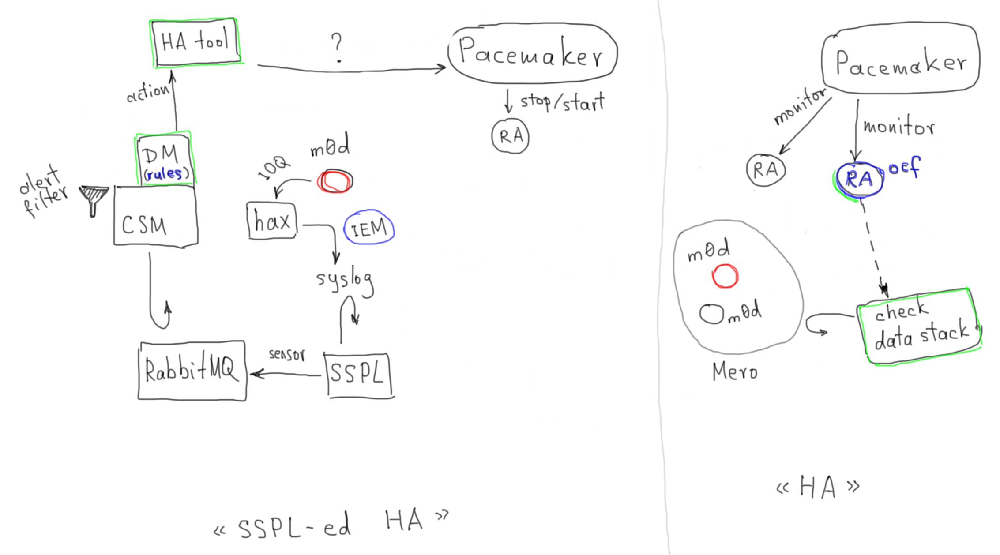

<!--
  Copyright (c) 2020 Seagate Technology LLC and/or its Affiliates

  Licensed under the Apache License, Version 2.0 (the "License");
  you may not use this file except in compliance with the License.
  You may obtain a copy of the License at

      http://www.apache.org/licenses/LICENSE-2.0

  Unless required by applicable law or agreed to in writing, software
  distributed under the License is distributed on an "AS IS" BASIS,
  WITHOUT WARRANTIES OR CONDITIONS OF ANY KIND, either express or implied.
  See the License for the specific language governing permissions and
  limitations under the License.

  For any questions about this software or licensing,
  please email opensource@seagate.com or cortx-questions@seagate.com.
-->

---
domain: github.com
shortname: 13/HALC
name: EES HA, Loosely Coupled
status: draft
editor: Valery V. Vorotyntsev <valery.vorotyntsev@seagate.com>
---

## Language

The key words "MUST", "MUST NOT", "REQUIRED", "SHALL", "SHALL NOT",
"SHOULD", "SHOULD NOT", "RECOMMENDED", "MAY", and "OPTIONAL" in this
document are to be interpreted as described in
[RFC 2119](https://tools.ietf.org/html/rfc2119).

## Examples

### s3server I/O error

Sequence of events:

1. s3server gets an I/O error.
2. s3server puts an IEM into the syslog.
3. SSPL is monitoring the syslog.  It notices an IEM in the syslog,
   generates an alert message and passes it to RabbitMQ.
4. CSM fetches the alert from RabbitMQ.
5. CSM invokes the Decision Maker (DM).
6. DM filters out unimportant alerts.
7. DM applies "rules": if the alert matches predefined _criteria_, a
   corresponding _action_ is taken.
8. DM's action is to invoke the "HA tool" (`hctl`).
9. HA tool invokes Pacemaker (e.g., `sudo pcs restart s3server-resource-name`).

### m0d I/O error

## Links

- [EESv1_HA_Failover_Scope spreadsheet][failures-table]
- [EESv1_M4_Architecture slides][m4-arc-slides]

[failures-table]: https://seagatetechnology-my.sharepoint.com/:x:/g/personal/ujjwal_lanjewar_seagate_com/EZMtI5RPgFJHuS2BbYXiAl8Bq6BdN0zqyCjtWPz5Ht8jsg?e=4%3AXDoYBa&at=9&CID=1f21ecd7-f1d4-b453-3855-d5af39417f95
[m4-arc-slides]: https://seagatetechnology-my.sharepoint.com/:p:/r/personal/ujjwal_lanjewar_seagate_com/_layouts/15/guestaccess.aspx?e=4%3AEcSrmG&at=9&CID=a60887cb-880f-9b62-0fb6-e7a0e4f44415&share=EQejLLrH9VxLtmHOsiG8dcoB0J9LtyGmThjm_ZFH7AcooQ
