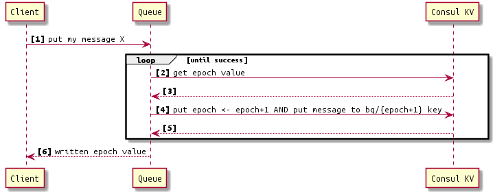
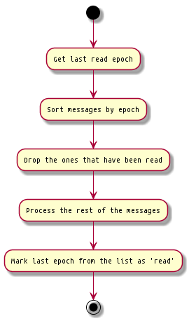
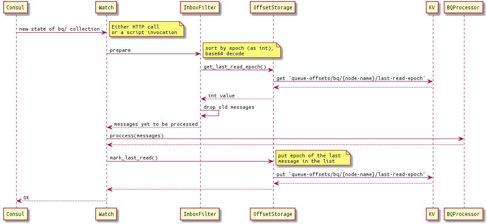

## Abstract

Broadcast Queue (BQ) is a transport for distributing broadcast messages from Recovery Coordinator (RC). 

Topology: RC node is the only publisher in the cluster; every node in the cluster is subscribed to those messages.

## Implementation

BQ is built on top of Consul KV. In other words, the Queue API invokes one or more Consul KV API calls internally and highly depends on Consul keyprefix watch.

### Message publishing

Notes:
1. Step \[4] is executed by means of [Consul Transaction](https://www.consul.io/api-docs/txn).
2. In step \[4], epoch key is updated with CAS. It means that if the epoch key is updated externally between steps \[2] and \[4], the update at \[4] will fail and cause the loop \[2] - \[4] to repeat.

### Message receival

Receiver must be registered as a [keyprefix watch](https://www.consul.io/docs/agent/watches.html#keyprefix) for `bq/` prefix in Consul. Thus anytime a new message is published to BQ, the receiver will acquire the new whole state of `bq/` collection.

Notes:
1. Definition of "Process the rest of messages" is not in the scope of this document.
2. The notion of 'last read epoch' implicitly means that there is a mechanism how to identify each message has already been processed. This document assumes that Consul KV will store the last-read epochs.

### Marking messages as read

Consul KV stores the last-read BQ epoch for every node.

Assumption:
- There can be no more than 1 subscriber at a node in the cluster.

## See also

* ["Consul-based Halon replacement (Hare). Design highlights"](https://seagatetechnology.sharepoint.com/sites/gteamdrv1/tdrive1224/_layouts/15/Doc.aspx?sourcedoc={D1E7E9B8-C4CC-4543-916E-4EF03C061C27}&file=Consul-based%20Halon%20replacement%20(Hare)%20-%20Design%20Highlights.docx&wdOrigin=OFFICECOM-WEB.MAIN.SEARCH&action=default&mobileredirect=true&cid=0f78d508-653a-4880-9e94-d81d57285935) document.
