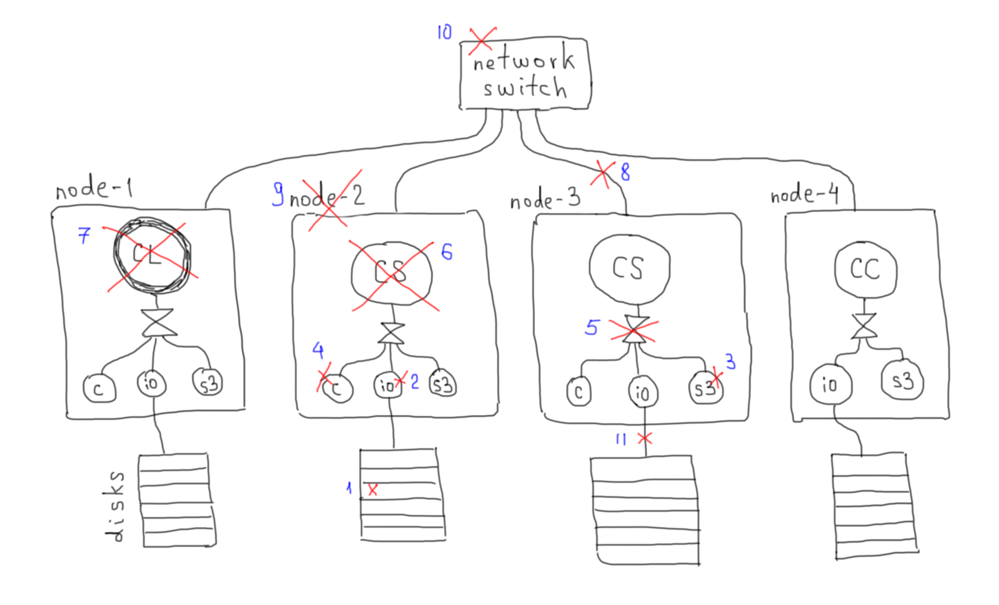

Keywords: BQ, EQ, RC, event, rule

<!-- XXX
  -- Keywords: EQ, BQ, RC, timers
  --
  -- Note: event types and rules (and rules' effects) will be specified in a separate RFC.
  -->

<!-- XXX TODO:
  --
  -- * Write the "EVERULES" (Events & Rules) RFC.
  --
  -- * Logging & observability.
  --
  -- * Add new terms to 10/GLOSS.
  --
  -- * Timers mechanism.
  --
  -- * "BQ-delivered" (a.k.a. BQ acks) mechanism.
  --
  -- * How to ensure that only RC can modify the BQ?
  --   See
  --   1. [ACL System](https://www.consul.io/docs/acl/acl-system)
  --   2. [Bootstrap the ACL system](https://learn.hashicorp.com/tutorials/consul/access-control-setup-production)
  --   3. [ACL Rules](https://www.consul.io/docs/acl/acl-rules)
  --
  -- * Read about Consul [Security Model](https://www.consul.io/docs/internals/security.html).  How can we apply that information?
  -->

## Language

The key words "MUST", "MUST NOT", "REQUIRED", "SHALL", "SHALL NOT", "SHOULD", "SHOULD NOT", "RECOMMENDED", "MAY", and "OPTIONAL" in this document are to be interpreted as described in [RFC 2119](https://tools.ietf.org/html/rfc2119).

## Implementation

### Prerequisites

* Consul KV store MUST have `eq/` and `bq` key prefix.

* Hare software package MUST provide `q` CLI utility.  Users SHOULD use this utility to put entries into EQ and BQ.

  Usage:
  ```sh
  CONSUL_ACL_TOKEN=<eq-write-token> q <key-prefix> <value>
  ```

### Event Queue (EQ)

The EQ is the queue of incoming _events_ that outside entities (e.g., Motr, HA, human operator) want Hare RC to know about.

The EQ is represented by Consul KV entries with `eq/` prefix.

<!-- XXX Describe epoch? -->

Adding event to the EQ:
```sh
CONSUL_ACL_TOKEN=<eq-write-token> q eq \
    '{ "type": "<event-type>", "payload": "<event-payload>" }'
```

Supported event types and their payload are specified in XXX/EVERULES.

### Recovery Coordinator (RC)

1. On the Consul leader node there MUST be configured a [watch](https://www.consul.io/docs/agent/watches.html#keyprefix) of "keyprefix" type that watches `eq/` key prefix.  Whenever the EQ is modified, the handler of this watch will execute the _RC_ and pass it full contents of the EQ in JSON format via stdin.

1. There MUST NOT be several simultaneously running RC instances.  <!-- XXX This is guaranteed by Consul, isn't it? -->

1. The RC MUST process all the events in the EQ.

1. To process an event, the RC finds the _rule_ associated with this event type and executes it.

   1. Rules are executable files.

   1. Rules MUST obtain event payload from the standard input.

   1. Rules SHOULD have _effects_.  E.g.: put an item into the BQ/EQ, add new entry to the system log, execute a shell command.

   Supported rules and their effects are specified in XXX/EVERULES.

1. It is RECOMMENDED to define a special `_default` rule.  The RC SHALL apply the `_default` rule if there is no rule associated with the type of processed event.

<!-- XXX We may borrow some rule processing ideas from iptables/nftables.
  -->

1. The RC MUST abort a rule that runs longer than predetermined \<timeout\>.

<!-- XXX How is RC to be configured?  Do we want to reconfigure it at runtime?
  -->

1. The same set of rules MUST be installed in the same directory on every Consul server node.

   E.g., a directory of rules that handle events of types "foo", "bar", and "baz" would look like this:
  ```sh
  rules/
   \_ _default
   \_ bar
   \_ baz
   \_ foo
  ```

1. The RC and rules SHOULD take configuration parameters from environment variables and SHOULD NOT use command line options.  <!-- Rationale: https://12factor.net/config -->

1. The RC MUST delete processed events from the EQ.

### Broadcast Queue (BQ)

The BQ is the queue of outgoing _messages_ that Hare RC wants to be delivered to all Motr processes.

The BQ is represented by Consul KV entries with `bq/` prefix.

Adding message to the BQ:
```sh
CONSUL_ACL_TOKEN=<bq-write-token> q bq <message>
```

<!-- XXX-OPTIMIZATION: `q` uses Consul transaction mechanism and CAS to increment the epoch.  If only RC is allowed to modify the BQ, we may want to use a more lightweight mechanism. -->

* Only RC SHOULD be able to modify the BQ.  <!-- XXX How to ensure that? -->

* For every Consul node there MUST be configured a watch of "keyprefix" type that watches `bq/` key prefix.  Whenever the BQ is modified, these watches will send full contents of the BQ in JSON format to local Hax processes over HTTP.

## Examples of Fault Handling



### 1. Disk failure

* Detected by Motr IOS when it tries to perform I/O operation.
* The IOS sends M0_HA_MSG_STOB_IOQ message to the local Hax.
* Hax puts an event into the EQ.  This triggers the RC.
* The RC applies the corresponding rule.
* The rule puts a message into the BQ.
* Consul BQ watch handlers send HTTP request with watch invocation
  data (contents of the BQ) to all Haxes.
* Upon receiving the request, each of the Haxes send the notification
  (M0_HA_MSG_NVEC) to the connected Motr processes.

<!-- XXX-TODO: Add a [sequence diagram](https://plantuml.com/sequence-diagram).
  -->

<!-- XXX DELETEME <<<<<<<
----------------------------------------------------------------------

## Implementation

### XXX

1. External agents - e.g., hax or SSPL - add events to the EQ (`eq/`
   key prefix in the Consul KV).  Format of an eq/<epoch> entry:
   "<event-type> <event-payload>".

1. EQ watch handler = the RC (Recovery Coordinator) script.  It runs
   at the Consul leader node.  At any given moment there is at most
   one RC process running.  RC is a short-term process — once it
   completes, it's gone.

1. The RC processes all events in the EQ, one by one.

1. Each <event-type> MUST be mapped to an RC rule. A rule is an
   executable file.  Rules MUST be installed on every Consul server
   node.  There MAY be one "default" RC rule defined.

1. To process an event, the RC passes <event-payload> to the corresponding rule.

   1. The side effects of every rule - results of Hare RC interaction
      with outside world - are specified in an RFC.  Examples of side
      effects: put an item into the BQ, add new entry to the systemd
      log, create new timer.

   1. Once the rule terminates, the RC removes the event from the EQ.

   1. If the rule exited with non-zero code, the RC MUST log the error
      in the systemd.

1. When new Consul leader is elected, it SHALL spawn the RC iff the EQ
   is not empty.

#### XXX-2

Add node-disks hierarchy (and their HA states) to Consul KV and cfgen.

hax gets drive failure events from Motr process, puts event into the
EQ; HA states are broadcast.

#### XXX EQ, EQ watch

EQ watch handler = the RC

Test script:
- Obtain <epoch> value (`utils/next-gen`).
- Put a single event into the EQ from a non-leader node.
  Event type = "test-rc".
- Rule implementation (`rules/test-rc`) does something simple and
  easily testable; e.g.,
  ```sh
  echo "$(date -uR) Hare RC runs at $HOSTNAME" > /tmp/test-rc.out"
  ```

### XXX BQ-delivered

* Consul KV key: bq-delivered/<node>
* Value: <BQ epoch>
* Description: max BQ epoch known to be delivered to any Motr process at
  the given node.

1. For each node of the cluster, the ID (epoch) of the last BQ item
   delivered to any Motr process at that node is stored in the Consul
   KV.

1. Hax updates the bq-delivered entry when any of the Motr processes
   (m0d or s3server) connected to it confirms delivery.

1. If a Motr process doesn't confirm delivery in <timeout> seconds,
   hax MAY report it to Consul as /unresponsive/.

1. Hax SHOULD NOT resend the “bq-delivered” BQ items to the Motr
   processes.

#### XXX Testing of BQ-delivered

* Test 1:
  - Put a single item into the BQ (bq/<epoch>).
  - Sleep <timeout> seconds.
  - Check the value of bq-delivered/<node> — it should be <epoch>.

* Test 2:
  - Make all _but one_ Motr processes on a particular <node>
    unresponsive (`kill -STOP` or attach gdb to them).  (The only
    unstopped Motr process should be able to receive and handle
    m0_ha_msg from hax.)
  - Perform Test 1.

* Test 3:
  - Make **all** Motr processes on a particular <node> unresponsive.
  - Put a single item into the BQ (bq/<epoch>).
  - Sleep <timeout> seconds.
  - bq-delivered/<node> KV entry should not exist.

### XXX RC, rules engine

Minimalistic prototype.

Ideas:

- timers (see ‘Timeouts’ section in the “Consul-based Halon replacement”
  document)
- `hctl rc` command shows RC rules' errors

#### XXX Event types specification (RFC)

Document how errors will be handled.

#### XXX Rule effects specification (RFC)

### XXX Scenarios

Degraded mode.

No spare disks:
- data pool direct rebalance

Spare disks available:
- data pool repair
- data pool rebalance

#### XXX DIX direct rebalance after power failure

Options:
1. SSPL or Motr puts an event into the EQ.
2. Explicit hctl command triggers the rebalance operation.

> DIX operation pause/resume/abort/progress

Design notes:
- hctl progress command invokes Spiel API directly.
- For the "progress" operation we may want to add a "rebalance op
  status" entry into the Consul KV and have the RC update it
  periodically (via timers?).  But may we can live without this
  optimization for now.

#### Node disconnect

Case 1:
- Put a "node disconnected" event into the EQ.  (This event type MUST
  be specified in the RFC.)
- The node and underlying disk groups become "offline" in the Consul KV.

Case 2:
- "Node disconnected" event.
- The node and underlying disk groups become "transient" in the Consul KV.
- The RC requests SSPL to ping the node.
- a) SSPL "node is online" reply comes before <timeout> expires.
  ==> The node and underlying DGs become "online" in the KV.
- b) SSPL "no access to node" reply comes before <timeout> expires.
  ==> ???
- c) After <timeout> seconds the node and its DGs become "offline" in
  the Consul KV.

#### SAS link disconnect

Ditto.

XXX-DELETEME >>>>>>> -->
