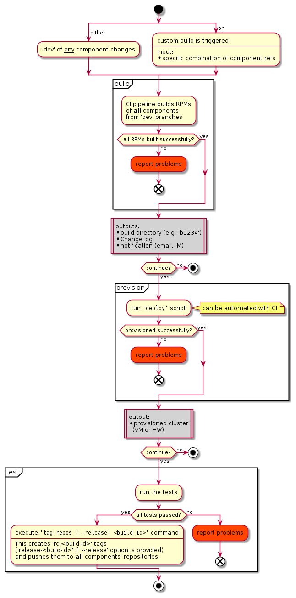

## Goals

* Simplify the release procedure.
* Increase confidence in releases.
* Reduce the likelihood of release being delayed due to human error.
* Minimize the "new release is broken" time.
* Eliminate the chance for build directory to contain incompatible RPMs.
* Remove reliance on many people (component maintainers) to update "release" references promptly and flawlessly.
* Update the "release" references as an atomic operation.
* Provide engineers with a convenient method of cluster provisioning.
* Test the product more.
* Make it trivial to checkout any of the previously released builds.

## Language

The key words "MUST", "MUST NOT", "REQUIRED", "SHALL", "SHALL NOT", "SHOULD", "SHOULD NOT", "RECOMMENDED", "MAY", and "OPTIONAL" in this document are to be interpreted as described in [RFC 2119](https://tools.ietf.org/html/rfc2119).

## Implementation

### CI/CD workflow

The workflow defines three stages of execution: _build_, _provision_, and _test_.  They MAY be executed all in one go, separately, or in twos (build -> provision; provision -> test).

A patch that is merged to 'dev' branch MUST compile cleanly and pass component self-tests.



### Release candidates

Assume the commit history of three components:

```
        a0---a1---a2---a3 dev

        b0---b1 dev

        c0---c1---c2 dev
```

Previous release was made of commits a0, b0, and c0:
```
release-<k> = { a0, b0, c0 }
```

Depending on availability, priorities, and throughput of QA engineers, they might be able to test several _release candidates_.

In the following example rc-a was tested by the QA engineers of component A, rc-g &mdash; by the "product QA" team.
```
rc-a = { a3, b0, c0 }
rc-c = { a0, b0, c2 }
rc-g = { a3, b1, c2 }
```

### Release

In order to be suitable for a _release_, a release candidate
1) SHOULD pass product test suite and
2) MUST be explicitly approved by a Product QA engineer.
