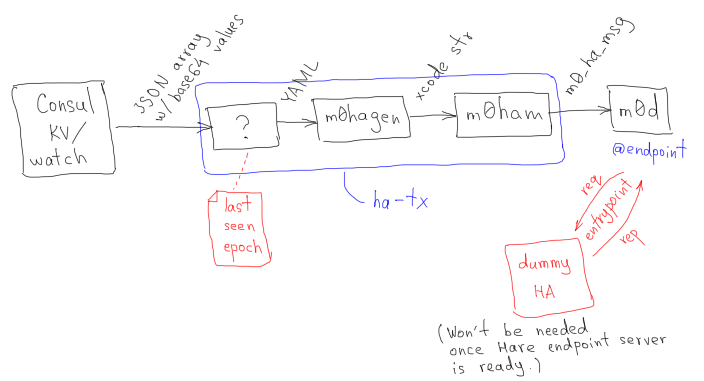

## ha-tx: HA Messages Transmitter



When Consul agents are started, each of them configures a [watch](https://www.consul.io/docs/agent/watches.html) that will monitor "BQ/" keyprefix in the Consul KV:
```
{
  "type": "keyprefix",
  "key": "BQ/",
  "args": ["/usr/bin/ha-tx", "0@lo:12345:34:101"]
}
```
Any modification of the "BQ/" directory in the Consul KV will trigger the watches.

`ha-tx`
- reads [JSON array of base64-encoded values](https://www.consul.io/docs/agent/watches.html#type-keyprefix) from stdin,
- converts the payload to `m0_ha_msg` and
- sends that message to the `m0d`, the endpoint of which is specified by CLI argument.
