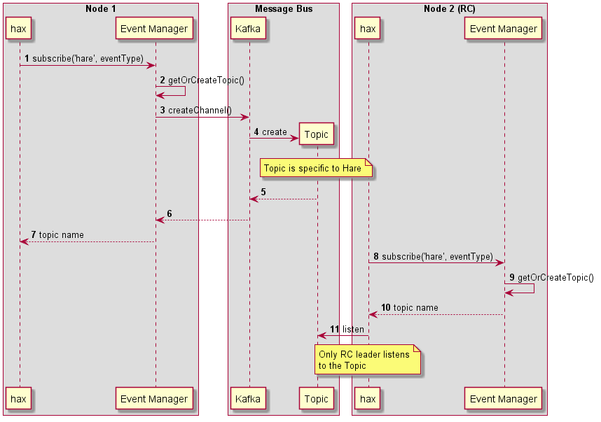
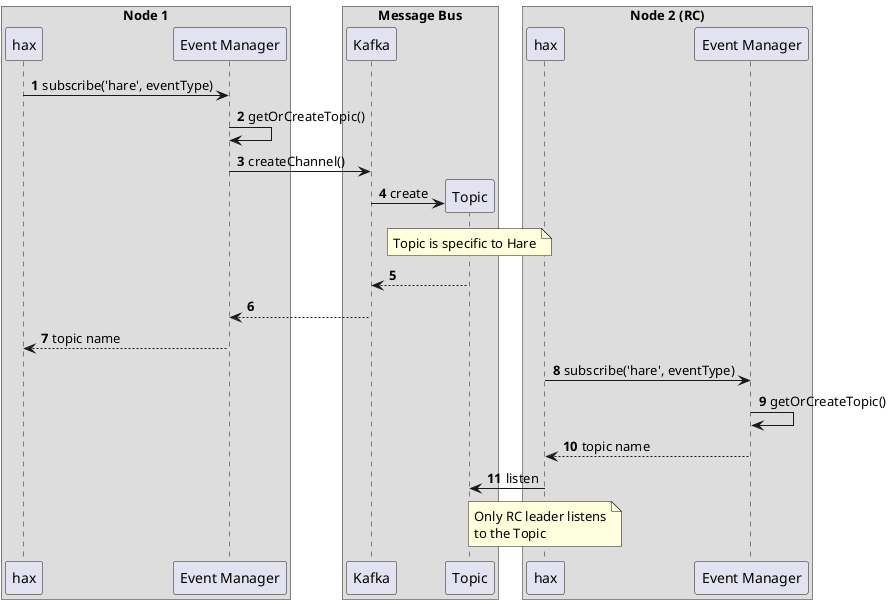
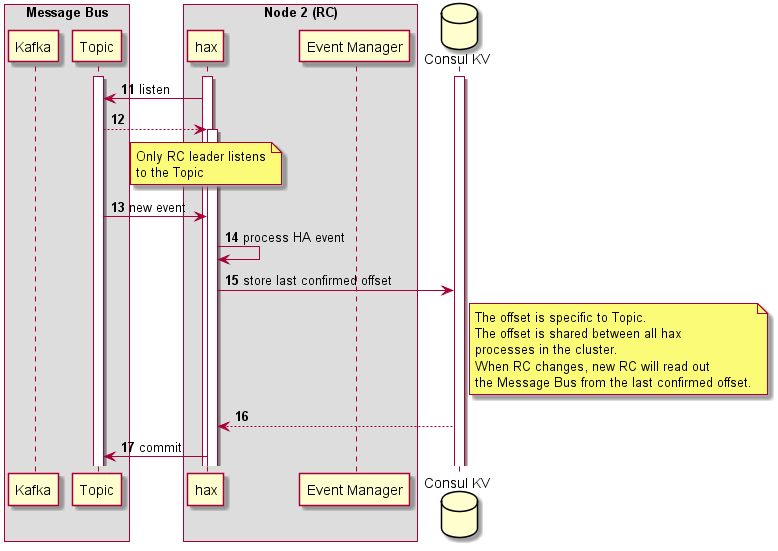
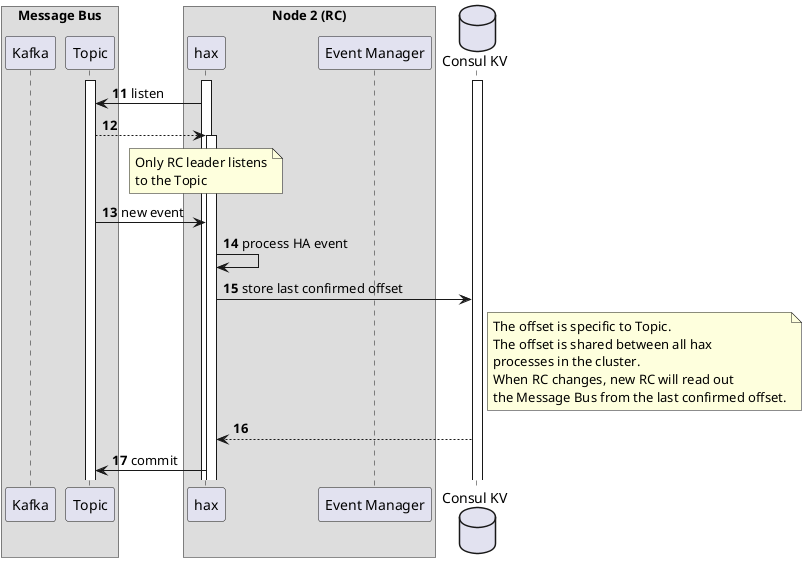

## Language

The key words "MUST", "MUST NOT", "REQUIRED", "SHALL", "SHALL NOT", "SHOULD", "SHOULD NOT", "RECOMMENDED", "MAY", and "OPTIONAL" in this document are to be interpreted as described in [RFC 2119](https://tools.ietf.org/html/rfc2119).

## Table of Contents

<!-- vim-markdown-toc GFM -->

* [HA events](#ha-events)
* [Core ideas](#core-ideas)
* [Subscription procedure](#subscription-procedure)
* [HA event processing](#ha-event-processing)
  * [Notes](#notes)
  * [Corner case: RC re-election](#corner-case-rc-re-election)
* [References](#references)

<!-- vim-markdown-toc -->

## HA events

Hare is an integration point between Motr layer and HA. Hare must subscribe to so called HA Events to be able to react and translate them into Motr API terms if needed. This RFC describes how Hare subscribes to HA Events.

## Core ideas

1. Every hax process registers at Event Manager
   - Hare assumes that Event Manager will either create the corresponding topic or just return one if it exists. Hare doesn't need to verify if the topic already exists.
2. HA events will be processed by RC leader only
3. Last read offset will be stored in Consul KV
4. When RC leader is re-elected, the hax at the new RC leader node must start listening to the topic
   - And it should start from the offset stored in Consul KV

## Subscription procedure

  
Diagram source

## HA event processing

  
Diagram source

### Notes

1. The speed of the message processing will highly depend on the performance of Consul KV PUT operation
   - It means that ideally, Hare needs to use one topic only. In other words, we need to be able to subscribe to a number of HA events with a single call. According to the current design, HA allows to subscribe to specific events only; the more event types we're interested in, the more separate topics will be created. This should be changed.
2. At this moment, hax doesn't get notification "RC Leader is re-elected". I believe we can implement it by subscribing a watcher on leader key or something.
   - Alternative approach would be to use proto-rc script instead of hax. But that will make the processing chain longer and thus slower and more fragile:
     - `Kafka -> proto-rc script -> HTTP request -> hax`
     - `Kafka -> proto-rc script -> EQ -> Consul -> hax` (even longer)

### Corner case: RC re-election

When RC leader changes (e.g. due to HW issue) it may happen that previous RC didn't finish processing a message from MessageBus. So the message was read out from the queue but it's processing wasn't finished.

The problem can be alleviated by the approach as follows.

1. RC Hax receives a message from MessageBus
1. RC Hax double checks "am I still RC" (if yes, then proceed, otherwise just ignore the message and stop listening MessageBus)
1. Process the message
   - If processing means sending out messages to Motr world, then send everything needed and wait until Motr side confirms delivery.
1. RC Hax double checks "am I still RC" (if yes, then proceed, otherwise just ignore the message and stop listening MessageBus)
1. And only after that update "last confirmed" offset in Consul KV

**Potential problems**

1. During point \[3\] either a failure can occur to RC node or RC leader can be just re-elected. When another RC starts working, the same message will be taken for processing and Motr messages will be repeated.
   - Suggestion:
     1. Instead of one state "Message confirmed" add two states "Last taken offset" and "Last confirmed ofset" (analogy: 2-phase commit in databases)
     2. When another RC starts working it can at least see if the offset was taken by another RC previously. There is a chance that that RC is alive and it is in the middle of processing that message. Probably the current RC must delay for some time until assuming that another RC is not healthy and the message must be processed once again.

## References

1. HA Event Manager LLD ([link](https://seagatetechnology.sharepoint.com/:w:/s/gteamdrv1/tdrive1224/EQG6wcfCtJJFvG-1QLTqAL8BmyKZYAbkE33TFKepvd6kuA?e=xkGIh1))
2. HA HLD ([link](https://seagatetechnology.sharepoint.com/:w:/r/sites/gteamdrv1/tdrive1224/_layouts/15/Doc.aspx?sourcedoc=%7B2C9E9047-0884-4F26-AF0D-A2CD2B51995E%7D&file=CORTX_HA_HLD.docx&action=default&mobileredirect=true))
