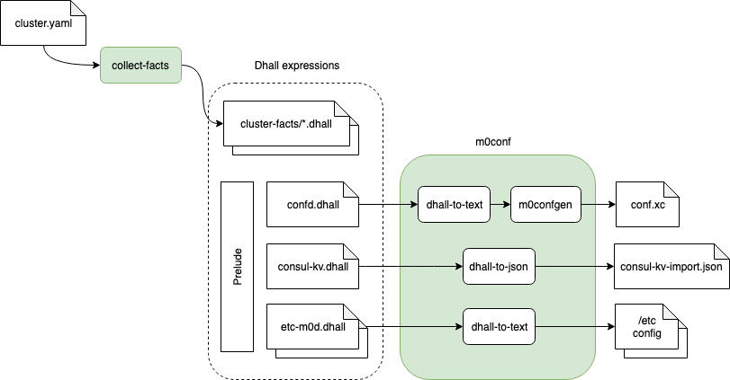

## Configuration Generation



### Cluster Description

This file is provided by cluster administrator.  Format:
```yaml
hosts:
  - name: <str>
    m0_servers:
      - endpoint: <str>
        confd: <bool>  # optional; defaults to `false`
        io_disks: <str>  # glob pattern; optional; defaults to `''` (no IOS)
    c0_clients:
      - endpoint: <str>
    m0t1fs_clients:
      - endpoint: <str>
pools:  # optional; by default a single pool is created
  - name: <str>
    disks:
      - host: <str>
        filter: <str>  # regexp; optional; defaults to `.`
    data_units: <int>
    parity_units: <int>
    allowed_failures:
      site: <int>
      rack: <int>
      encl: <int>
      ctrl: <int>
      disk: <int>
```

### `collect-facts`

| Input          | Output                  |
| -------------- | ----------------------- |
| `cluster.yaml` | `cluster-facts/*.dhall` |

`collect-facts` script reads cluster description from stdin, ssh-es to the hosts mentioned there, collects "facts" about them (e.g., `facter --json processors | jq .processors.count`, `facter memorysize_mb`) and saves this data locally as [Dhall](https://dhall-lang.org/) expressions (`cluster-facts/*.dhall`).

### `m0conf`

`m0conf` runs a particular Dhall processing pipeline, selected via CLI option.

`m0conf --confd` outputs Mero configuration in xcode string format, ready to be consumed by confd services.

`m0conf --etc m0d` outputs /etc configuration for m0d process.

`m0conf --kv` outputs KV pairs in JSON format, ready to be consumed by [`consul kv import`](https://www.consul.io/docs/commands/kv/import.html).
