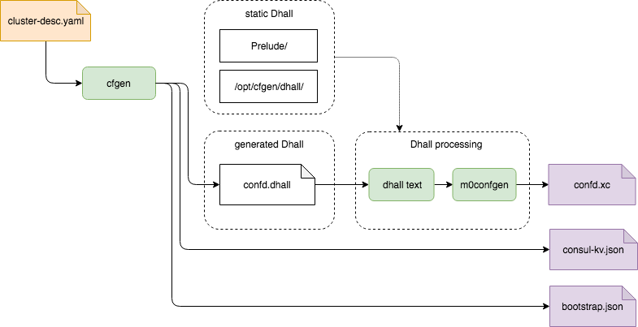

<!--
  Copyright (c) 2020 Seagate Technology LLC and/or its Affiliates

  Licensed under the Apache License, Version 2.0 (the "License");
  you may not use this file except in compliance with the License.
  You may obtain a copy of the License at

      http://www.apache.org/licenses/LICENSE-2.0

  Unless required by applicable law or agreed to in writing, software
  distributed under the License is distributed on an "AS IS" BASIS,
  WITHOUT WARRANTIES OR CONDITIONS OF ANY KIND, either express or implied.
  See the License for the specific language governing permissions and
  limitations under the License.

  For any questions about this software or licensing,
  please email opensource@seagate.com or cortx-questions@seagate.com.
-->

---
domain: gitlab.mero.colo.seagate.com
shortname: 3/CFGEN
name: Configuration Generation
status: stable
editor: Valery V. Vorotyntsev <valery.vorotyntsev@seagate.com>
contributors:
  - Andriy Tkachuk <andriy.tkachuk@seagate.com>
---

## Language

The key words "MUST", "MUST NOT", "REQUIRED", "SHALL", "SHALL NOT",
"SHOULD", "SHOULD NOT", "RECOMMENDED", "MAY", and "OPTIONAL" in this
document are to be interpreted as described in
[RFC 2119](https://tools.ietf.org/html/rfc2119).

## Configuration Generation

Configuration generation script &mdash; `cfgen` &mdash; generates
various configuration files required to start Motr cluster.



### Cluster Description File (CDF)

Cluster administrator SHALL provide a _cluster description file_ (CDF),
specifying which hosts the cluster is made of, how many Motr services
and clients to run, where to run confd services, which drives to use
for Motr I/O.

CDF is a YAML file with the following schema:
```yaml
nodes:
  - hostname: <str>    # [user@]hostname; e.g., localhost, pod-c1
    data_iface: <str>  # name of network interface; e.g., eth1, eth1:c1
    data_iface_type: tcp|o2ib  # type of network interface;
                               # optional, defaults to "tcp"
    m0_servers:
      - runs_confd: <bool>  # optional, defaults to false
        io_disks: [ <str> ] # e.g. [ "/dev/loop0", "/dev/loop1", "/dev/loop2" ]
                            # Empty list means no IO service.
    m0_clients:
        s3: <int>     # number of S3 servers to start
        other: <int>  # max quantity of other Motr clients this host may have
pools:
  - name: <str>
    type: sns|dix|md   # type of pool; optional, default is "sns"
                       # "sns" for data, "dix" for "kv" and md for meta-data
    allowed_failures:  # optional section; no failures will be allowed
                       # if this section is missing or all of its elements
                       # are zeroes
      site: <int>
      rack: <int>
      encl: <int>
      ctrl: <int>
      disk: <int>
    data_units: <int>
    parity_units: <int>
    #
    # There are several ways of assigning disks to pool.
    #
    # 1) Use all available disks of all nodes for this pool.
    #disks: all
    # 2) Use one disk per CAS service
    #disks: per_cas
    # 3) Use first disk on controller
    #disks: first_disk
```

### `cfgen` script

```
usage: cfgen [OPTION]... CDF

Generate configuration files required to start Motr cluster.

positional arguments:
  CDF                  cluster description file; use '--help-schema' option
                       for format description

optional arguments:
  -h, --help           show this help message and exit
  --help-schema        show the schema of cluster description file (CDF)
  -D dir, --dhall dir  directory with auxiliary Dhall expressions (defaults to
                       '/opt/seagate/cortx/hare/share/cfgen/dhall')
  -o output-dir        output directory (defaults to '.')
  --mock               Generate pseudo-random "facts". The hosts specified in
                       the cluster description file will not be visited and
                       don't even have to exist.
  --debug              print the enriched cluster description and exit
  -V, --version        show program's version number and exit
```

**cfgen** reads the CDF, ssh-es to the hosts mentioned in it, collects
their "facts" (e.g., number of CPUs, RAM size), and uses that information
to generate configuration data.

### Output files

  * `confd.dhall` &mdash; Motr configuration in
    [Dhall](https://dhall-lang.org/) format.

  * `consul-agents.json` &mdash; tells [`bootstrap`](rfc/6/README.md) script
    where Consul server and client agents should be started and which
    IP addresses they should bind to.

    Format:
    ```
    {
      "servers": [
        {
          "node_name": "<str>",
          "ipaddr": "<str>"
        }
      ],
      "clients": [
        {
          "node_name": "<str>",
          "ipaddr": "<str>"
        }
      ]
    }
    ```
    `"servers"` list MUST NOT be empty.

  * `consul-kv.json` &mdash; key/value pairs in JSON format, ready to be
    consumed by
    [`consul kv import`](https://www.consul.io/docs/commands/kv/import.html).
