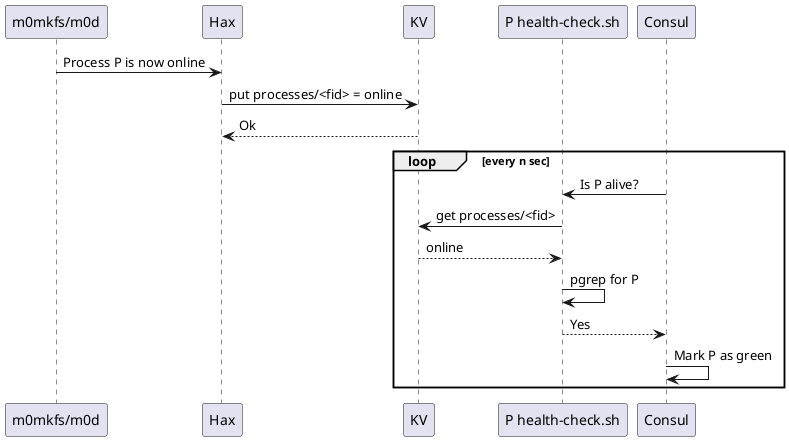
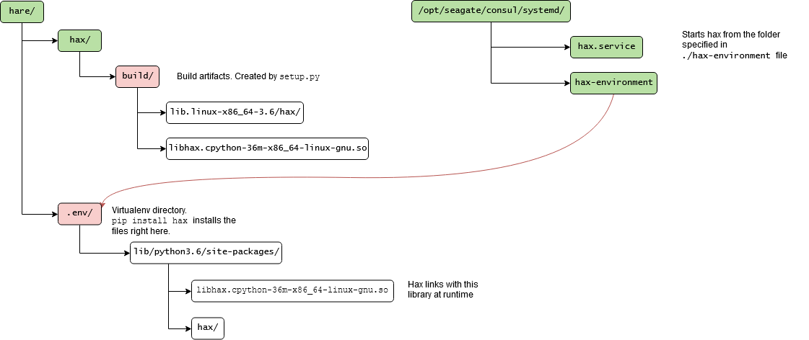

# Language

The key words "MUST", "MUST NOT", "REQUIRED", "SHALL", "SHALL NOT", "SHOULD", "SHOULD NOT", "RECOMMENDED", "MAY", and "OPTIONAL" in this document are to be interpreted as described in [RFC 2119](https://tools.ietf.org/html/rfc2119).

# General Architecture

## HAlink eXchange (hax)

Mero process and Consul agent cannot communicate directly.  They communicate over `hax` server — a bridge, one side of which accepts connections from Mero processes, the other side communicates with Consul agent over HTTP.


The code of `hax` consists of C and Python parts.

* C part maintains HA link (`m0_ha_link`) connections with one or more `m0d` processes.  The code uses `m0_halon_interface` API.
* The callback functions passed to `m0_halon_interface_start()` are defined in the Python code.  Callback handlers (e.g., `entrypoint_request_cb`, `msg_received_cb`) send HTTP requests to Consul.
* Python part also runs HTTP server.  This server receives HTTP POST request from a Consul's watch handler with payload of HA state updates.

# Interaction with Mero

## Interaction Use Cases

## Various Technical Details

### Fids for `m0_halon_interface_start()`

`hax` has to pass 3 fid parameters to `m0_halon_interface_start()`:
- process fid (<0x72...:...>) of the current process (the `hax` itself);
- HA service fid (<0x73...:...>) — fid of the HA service run by current process;
- RM service fid — fid of the RM service run by current process.

When `hax` is starting up, it fetches its process `.f_key` from Consul:

```
$ curl -s \
    http://localhost:8500/v1/catalog/service/hax?filter=Node==$(hostname) |
    jq -r '.[] | .ServiceID'
10
```

From this the Process fid is obtained by adding 0x7200000000000001 `.f_container`
to it (always the same for processes). Note, the value is in decimal format,
so the resulting fid here will be `0x7200000000000001:0xa`.

HA service fid is obtained from the process fid by changing the most significant
byte of `.f_container` to 0x73 and incrementing `.f_key`.

RM service fid is obtained by incrementing `.f_key` of the HA service fid.

Example:
```
0x7200000000000001:0xa -- hax process fid (received from Consul)
0x7300000000000001:0xb -- HA service fid (MSB of .f_container changed to 0x73, .f_key incremented)
0x7300000000000001:0xc -- RM service fid (.f_key incremented)
```

**Notes:**

1. HA and RM fids are not stored in Consul.
   - @mandar.sawant In current implementation this is not true. Can you please update this RFC and add some details?
2. Hare bootstrap MUST guarantee uniqueness of the fids, generated by the above algorithm.


### Mero service notifications

#### HA Link callbacks support

Hax processes the following callbacks from `ha_link` (via `m0_ha_halon_interface`):

1. Entrypoint requests
2. Process status change (namely, `M0_HA_MSG_EVENT_PROCESS` message with event type `M0_CONF_HA_PROCESS_STARTED` or `M0_CONF_HA_PROCESS_STOPPED`). Upon these events receival, hax must update the corresponding KV pair.

**Notes:**

1. Hax MUST NOT make any assumption whether the service is registered in Consul. Service registering and watching the KV with the service status is out of  hax' responsibilty.
2. In the future we might want to support Mero service update events (namely, `M0_HA_MSG_EVENT_SERVICE` message with event type `M0_CONF_HA_SERVICE_FAILED`, `M0_CONF_HA_SERVICE_STOPPED` or `M0_CONF_HA_SERVICE_FAILED` - see `m0_conf_ha_service_event` enum in `mero/conf/ha.h`). For the current version this functionality more like an overkill.
3. In the future versions process update events must be forwarded through Consul-based Event Queue.

### Storing process status in Consul KV

The general idea of storing the mero process status in Consul KV can be seen below.



**Notes:**

1. `fid` in the proposed Consul KV key `processes/<fid>` corresponds to the process fid (this guarantees that the key is unique within `processes/` prefix).
   - This means that the check script (health-check.sh) must know the fid of the processes it monitors.
   - This is OK that the keys in the KV are not reader-friendly and don't expose the logical name of the mero process. The end user will need to look into [Consul services](https://www.consul.io/api/agent/service.html) to learn the state of the particular mero process.
2. Checker script must check both value in Consul KV and `pgrep` the process. This is required to make sure that the value in KV is not obsolete.
3. "online" status shown at the diagram is chosen for the sake of simplicity. The exhaustive list of the values to store can be seen in [4/KV](../4/README.md).
# Interaction with Consul

Internally `hax` uses [python-consul](https://pypi.org/project/python-consul/) Python module to interact with Consul. HaX depends on Consul KV and Consul watchers.

## Incoming HTTP requests

`hax` receives HTTP POST requests from Consul's [watch handler](https://www.consul.io/docs/agent/watches.html#http-endpoint).  The payload is JSON formatted data with the following structure:

<details>

<summary>See here</summary>
```json
[{
    "Node": {
        "ID": "1e980571-4a55-bb9d-5eca-e37c06eead07",
        "Node": "sage75",
        "Address": "192.168.180.162",
        "Datacenter": "dc1",
        "TaggedAddresses": {
            "lan": "192.168.180.162",
            "wan": "192.168.180.162"
        },
        "Meta": {
            "consul-network-segment": ""
        },
        "CreateIndex": 5,
        "ModifyIndex": 6
    },
    "Service": {
        "ID": "0x7200000000000001:0x0004",
        "Service": "confd",
        "Tags": [],
        "Meta": null,
        "Port": 101,
        "Address": "@tcp:12345:44",
        "Weights": {
            "Passing": 1,
            "Warning": 1
        },
        "EnableTagOverride": false,
        "CreateIndex": 6,
        "ModifyIndex": 6,
        "Proxy": {
            "DestinationServiceName": "",
            "Upstreams": null
        },
        "Connect": {}
    },
    "Checks": [{
        "Node": "sage75",
        "CheckID": "serfHealth",
        "Name": "Serf Health Status",
        "Status": "passing",
        "Notes": "",
        "Output": "Agent alive and reachable",
        "ServiceID": "",
        "ServiceName": "",
        "ServiceTags": [],
        "Definition": {
            "Interval": "0s",
            "Timeout": "0s",
            "DeregisterCriticalServiceAfter": "0s",
            "HTTP": "",
            "Header": null,
            "Method": "",
            "TLSSkipVerify": false,
            "TCP": ""
        },
        "CreateIndex": 5,
        "ModifyIndex": 5
    }, {
        "Node": "sage75",
        "CheckID": "service:0x7200000000000001:0x0004",
        "Name": "Service 'confd' check",
        "Status": "passing",
        "Notes": "",
        "Output": "",
        "ServiceID": "0x7200000000000001:0x0004",
        "ServiceName": "confd",
        "ServiceTags": [],
        "Definition": {
            "Interval": "0s",
            "Timeout": "0s",
            "DeregisterCriticalServiceAfter": "0s",
            "HTTP": "",
            "Header": null,
            "Method": "",
            "TLSSkipVerify": false,
            "TCP": ""
        },
        "CreateIndex": 6,
        "ModifyIndex": 72
    }]
}]
```
</details>

The incoming HTTP requests bring the changes in the service states that Consul is aware of. Hax takes this information and forwards it via `ha_link` to Mero (see `m0_ha_notify` function in `hax/hax.c`).

# Developer's Corner
## Threading model

### Is `m0_thread_adopt` necessary?

Mero functions - including FFI callbacks triggered by Mero - _may_ require that the threads they run on have thread-local storage (TLS) initialised in a specific way.  The threads managed by Python runtime do not meet this assumption, unless `hax` code makes `m0_thread_adopt` calls in proper places (`m0_thread_adopt` performs TLS initialisation as required by Mero).  The question is, whether Mero code executed by `hax` will actually _depend_ on Mero-specific TLS?  The most likely answer is “yes”.

### Some facts about Python threads

1. Threads created with [threading](https://docs.python.org/3/library/threading.html) API or with lower level [_thread](https://docs.python.org/3/library/_thread.html) API are not green threads.
2. Every time Python interpreter creates a thread on Linux platform, a new pthread (POSIX thread) is created.  Python thread never changes the underlying pthread.
3. The Python Global Interpreter Lock (GIL) is a mutex that allows only one thread to hold the control of the Python interpreter.  This means that only one thread can be in a state of execution at any point in time.
4. When calling a Python land from a non-python thread (e.g. from a callback from a foreign library), the GIL must be properly acquired first, see [details](https://docs.python.org/3.6/c-api/init.html#non-python-created-threads). As a result the, the corresponding execution of the Python code will become effectively single-threaded unless the C extension will release GIL. That's one of the reasons why hax replies to an entrypoint request from a different thread.

### Useful links

* `PyThread_start_new_thread` function ([source](https://github.com/python/cpython/blob/3.7/Python/thread_pthread.h#L179))
* [Coding patterns for Python extensions](https://pythonextensionpatterns.readthedocs.io/en/latest/)


## Installation details

### Development mode

In development mode (i.e. when hax is built and installed locally with `bootstrap` and `install` scripts) the directory layout looks as follows.



