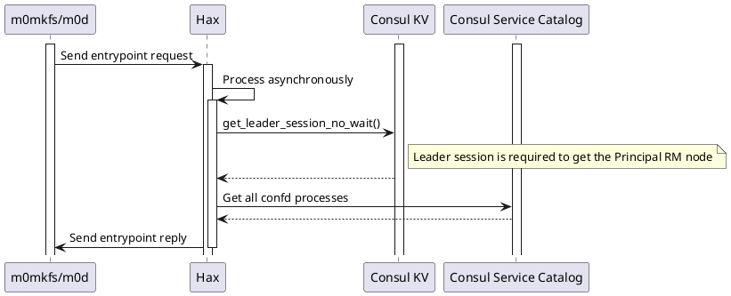
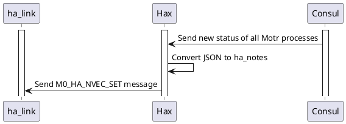
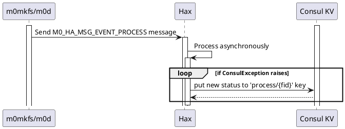
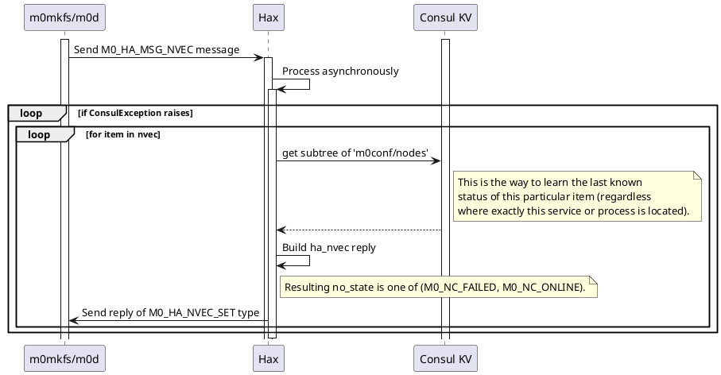
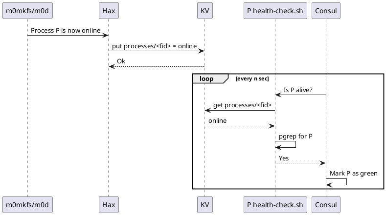

## Language

The key words "MUST", "MUST NOT", "REQUIRED", "SHALL", "SHALL NOT", "SHOULD", "SHOULD NOT", "RECOMMENDED", "MAY", and "OPTIONAL" in this document are to be interpreted as described in [RFC 2119](https://tools.ietf.org/html/rfc2119).

## HAlink eXchange (hax)

Motr process and Consul agent cannot communicate directly.  They communicate over `hax` server — a bridge, one side of which accepts connections from Motr processes, the other side communicates with Consul agent over HTTP.


The code of `hax` consists of C and Python parts.

* C part maintains HA link (`m0_ha_link`) connections with one or more `m0d` processes.  The code uses `m0_halon_interface` API.
* The callback functions passed to `m0_halon_interface_start()` are defined in the Python code.  Callback handlers (e.g., `entrypoint_request_cb`, `msg_received_cb`) send HTTP requests to Consul.
* Python part also runs HTTP server.  This server receives HTTP POST request from a Consul's watch handler with payload of HA state updates.

## Interaction with Motr

### Messages from Motr

[m0_ha_msg_type][] | Reaction of `hax`
--- | ---
M0_HA_MSG_STOB_IOQ | Ignore.
M0_HA_MSG_NVEC | Build the reply based on Consul data; see the [details below](#4-handling-of-nvec-get-request).
M0_HA_MSG_FAILURE_VEC_REQ | Reply with stub data &mdash; empty vector for fid `M0_FID_TINIT('o', 2, 9)`.
M0_HA_MSG_FAILURE_VEC_REP | Reply with stub data &mdash; empty vector for fid `M0_FID_TINIT('o', 2, 9)`.
M0_HA_MSG_KEEPALIVE_REQ | `m0_panic()`
M0_HA_MSG_KEEPALIVE_REP | `m0_panic()`
M0_HA_MSG_EVENT_PROCESS | Update the status in Consul KV; see the [details below](#3-handling-of-m0-ha-msg-event-process-message).
M0_HA_MSG_EVENT_SERVICE | Ignore.
M0_HA_MSG_EVENT_RPC | Ignore.
M0_HA_MSG_BE_IO_ERR | `m0_panic()`
M0_HA_MSG_SNS_ERR | `m0_panic()`

[m0_ha_msg_type]: http://gitlab.mero.colo.seagate.com/mero/mero/blob/master/ha/msg.h#L70

### Interaction Use Cases

#### 1. Hax replies to incoming entrypoint requests



**Notes**:
1. Entrypoint request replies are sent from a different thread to the one which received the request.
2. The order of replies is the same to the order of received requests.
3. If hax is not able to build the reply (e.g. if Consul is not operational), hax will send `EAGAIN` back to the Motr process. Motr process MUST repeat the request.

#### 2. Consul watch sends new Motr process statuses

When Consul watch sends new Motr process statuses, `hax` forwards the statuses via ha_link.


**Notes**:
1. Incoming HTTP requests from Consul are processed in MainThread.
2. The new HTTP request will not be handled until the current HTTP request has been processed.

#### 3. Handling of M0_HA_MSG_EVENT_PROCESS message

Having received M0_HA_MSG_EVENT_PROCESS from Motr, `hax` updates process status in the Consul KV.



**Notes**:
1. The message is processed asynchronously in hax.
2. No other asynchronous requests can start processing until the current one gets processed.
   - Corollary: In case of Consul consistency issues, all asynchronous processing will be effectively paused: hax will only be responsive on HTTP requests during that time.

#### 4. Handling of NVEC_GET request



**Notes**:
1. The message is processed asynchronously in hax.
2. No other asynchronous requests can start processing until the current one gets processed.
   - Corollary: In case of Consul consistency issues, all asynchronous processing will be effectively paused: hax will only be responsive on HTTP requests during that time.

### HA Link callbacks support

Hax processes the following callbacks from `ha_link` (via `m0_ha_halon_interface`):

1. Entrypoint requests
2. Process status change (namely, `M0_HA_MSG_EVENT_PROCESS` message with event type `M0_CONF_HA_PROCESS_STARTED` or `M0_CONF_HA_PROCESS_STOPPED`). Upon these events receival, hax must update the corresponding KV pair.

**Notes:**

1. Hax MUST NOT make any assumption whether the service is registered in Consul. Service registering and watching the KV with the service status is out of  hax' responsibilty.
2. In the future we might want to support Motr service update events (namely, `M0_HA_MSG_EVENT_SERVICE` message with event type `M0_CONF_HA_SERVICE_FAILED`, `M0_CONF_HA_SERVICE_STOPPED` or `M0_CONF_HA_SERVICE_FAILED` - see `m0_conf_ha_service_event` enum in `mero/conf/ha.h`). For the current version this functionality more like an overkill.
3. In the future versions process update events must be forwarded through Consul-based Event Queue.

### Storing process status in Consul KV

The general idea of storing the motr process status in Consul KV can be seen below.



**Notes:**

1. `fid` in the proposed Consul KV key `processes/<fid>` corresponds to the process fid (this guarantees that the key is unique within `processes/` prefix).
   - This means that the check script (health-check.sh) must know the fid of the processes it monitors.
   - This is OK that the keys in the KV are not reader-friendly and don't expose the logical name of the motr process. The end user will need to look into [Consul services](https://www.consul.io/api/agent/service.html) to learn the state of the particular motr process.
2. Checker script must check both value in Consul KV and `pgrep` the process. This is required to make sure that the value in KV is not obsolete.
3. "online" status shown at the diagram is chosen for the sake of simplicity. The exhaustive list of the values to store can be seen in [4/KV](../4/README.md).

## Interaction with Consul

Internally `hax` uses [python-consul](https://pypi.org/project/python-consul/) Python module to interact with Consul. HaX depends on Consul KV and Consul watches.

### Incoming HTTP requests

`hax` receives HTTP POST requests from Consul's [watch handler](https://www.consul.io/docs/agent/watches.html#http-endpoint).  The payload is JSON formatted data with the following structure:

<details>

<summary>Sample JSON...</summary>


```json
[{
    "Node": {
        "ID": "1e980571-4a55-bb9d-5eca-e37c06eead07",
        "Node": "sage75",
        "Address": "192.168.180.162",
        "Datacenter": "dc1",
        "TaggedAddresses": {
            "lan": "192.168.180.162",
            "wan": "192.168.180.162"
        },
        "Meta": {
            "consul-network-segment": ""
        },
        "CreateIndex": 5,
        "ModifyIndex": 6
    },
    "Service": {
        "ID": "0x7200000000000001:0x0004",
        "Service": "confd",
        "Tags": [],
        "Meta": null,
        "Port": 101,
        "Address": "@tcp:12345:44",
        "Weights": {
            "Passing": 1,
            "Warning": 1
        },
        "EnableTagOverride": false,
        "CreateIndex": 6,
        "ModifyIndex": 6,
        "Proxy": {
            "DestinationServiceName": "",
            "Upstreams": null
        },
        "Connect": {}
    },
    "Checks": [{
        "Node": "sage75",
        "CheckID": "serfHealth",
        "Name": "Serf Health Status",
        "Status": "passing",
        "Notes": "",
        "Output": "Agent alive and reachable",
        "ServiceID": "",
        "ServiceName": "",
        "ServiceTags": [],
        "Definition": {
            "Interval": "0s",
            "Timeout": "0s",
            "DeregisterCriticalServiceAfter": "0s",
            "HTTP": "",
            "Header": null,
            "Method": "",
            "TLSSkipVerify": false,
            "TCP": ""
        },
        "CreateIndex": 5,
        "ModifyIndex": 5
    }, {
        "Node": "sage75",
        "CheckID": "service:0x7200000000000001:0x0004",
        "Name": "Service 'confd' check",
        "Status": "passing",
        "Notes": "",
        "Output": "",
        "ServiceID": "0x7200000000000001:0x0004",
        "ServiceName": "confd",
        "ServiceTags": [],
        "Definition": {
            "Interval": "0s",
            "Timeout": "0s",
            "DeregisterCriticalServiceAfter": "0s",
            "HTTP": "",
            "Header": null,
            "Method": "",
            "TLSSkipVerify": false,
            "TCP": ""
        },
        "CreateIndex": 6,
        "ModifyIndex": 72
    }]
}]
```


</details>

The incoming HTTP requests bring the changes in the service states that Consul is aware of. Hax takes this information and forwards it via `ha_link` to Motr (see `m0_ha_notify` function in `hax/hax.c`).

