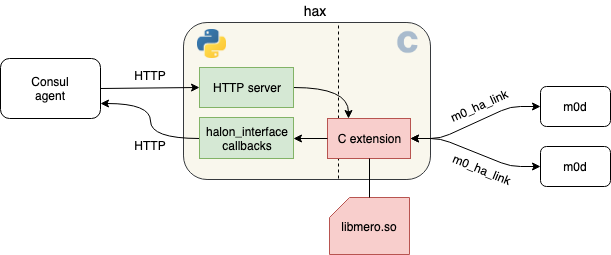

## HA link eXtender (hax)

Mero process and Consul agent cannot communicate directly.  They communicate over `hax` server — a bridge, one side of which accepts connections from Mero processes, the other side communicates with Consul agent over HTTP.

The code of `hax` consists of C and Python parts.

* C part maintains HA link (`m0_ha_link`) connections with one or more `m0d` processes.  The code uses `m0_halon_interface` API.
* The callback functions passed to `m0_halon_interface_start()` are defined in the Python code.  Callback handlers (e.g., `entrypoint_request_cb`, `msg_received_cb`) send HTTP requests to Consul.
* Python part also runs HTTP server.  This server receives HTTP POST request from
  a Consul watch handler (for BQ/ in KV Store or a service Health Check) with
  HA State updates.
