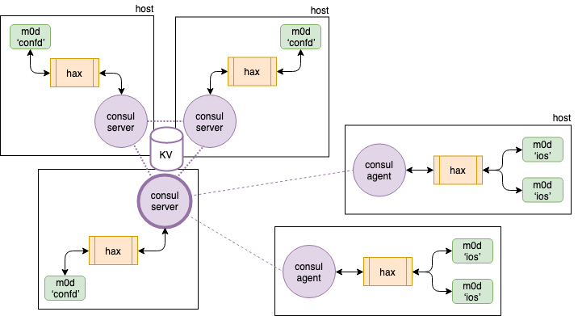

## Language

The key words "MUST", "MUST NOT", "REQUIRED", "SHALL", "SHALL NOT",
"SHOULD", "SHOULD NOT", "RECOMMENDED", "MAY", and "OPTIONAL" in this
document are to be interpreted as described in
[RFC 2119](https://tools.ietf.org/html/rfc2119).

## Motr cluster bootstrap

Cluster administrator

1. Prepares the
   [cluster description file (CDF)](https://github.com/Seagate/cortx-hare/blob/main/rfc/3/README.md#cluster-description-file-cdf).

2. Runs `hctl bootstrap --mkfs` command, passing it the CDF as an argument.
   The script MUST be started on a node which, accordingly to the CDF,
   will run ‘confd’ Motr service.  If `hctl bootstrap` is started on a
   non-confd node, the script MUST exit with non-zero code.

   **Caution:** if there is Motr store configured for the cluster,
   `--mkfs` option will erase its data.

`hctl bootstrap --mkfs` command

1. Executes [‘cfgen’ script](https://github.com/Seagate/cortx-hare/blob/main/rfc/3/README.md#cfgen), which generates
   `confd.dhall`, `consul-agents.json`, and `consul-kv.json` files.

2. Converts `confd.dhall` to `confd.xc`.

3. Starts `consul` server agent with
   [`-bootstrap-expect=1`](https://www.consul.io/docs/agent/options.html#_bootstrap_expect)
   option and gives it a few seconds to get going.

4. Initialises [Consul KV](https://github.com/Seagate/cortx-hare/blob/main/rfc/4/README.md) by executing
   `consul kv import @consul-kv.json` command or its equivalent.

5. Starts `consul` agents on every node of the cluster, knowing from
   `consul-agents.json` file where to run server and client agents.

6. Gets fids of Motr services from the Consul KV.  Updates the
   corresponding fields in `consul-config_{server,client}.json`
   templates on every node of the cluster.  Executes
   [`consul reload`](https://www.consul.io/docs/commands/reload.html)
   on every node.

7. Starts `hax` on every node of the cluster.  Each `hax` process
   obtains its [three fids](#8) from the Consul KV.

8. Starts ‘confd’ Motr servers on the Consul server nodes.  For each
   confd Motr server:

   - obtains host name and process fid from the Consul KV;
   - uploads `confd.xc` file;
   - starts `m0mkfs` process;
   - waits for `m0mkfs` to terminate;
   - starts `m0d` process.

9. Waits for ‘confd’ servers to start.

10. Starts other (non-confd) Motr servers.  For each non-confd Motr server:

    - obtains host name and process fid from the Consul KV;
    - starts `m0mkfs` process;
    - waits for `m0mkfs` to terminate;
    - starts `m0d` process(es).

11. Starts S3 servers.  For each S3 server:

    - obtains process fid from the Consul KV;
    - adds service and watch entries to Consul configuration file;
    - adds sysconfig and systemd entries;
    - starts the S3 server.

**Note:** `hctl bootstrap` command waits for a Motr process by polling
status of the corresponding Consul service; see
[5/HAX](https://github.com/Seagate/cortx-hare/blob/main/rfc/5/README.md#storing-process-status-in-consul-kv) for more
details.

## Design Highlights

* Motr ‘confd’ services SHALL be collocated with Consul server agents.
* Several ‘confd’ service SHALL NOT be running on the same node.
* Several Motr servers MAY be running on the same node.
* Several S3 servers MAY be running on the same node.
